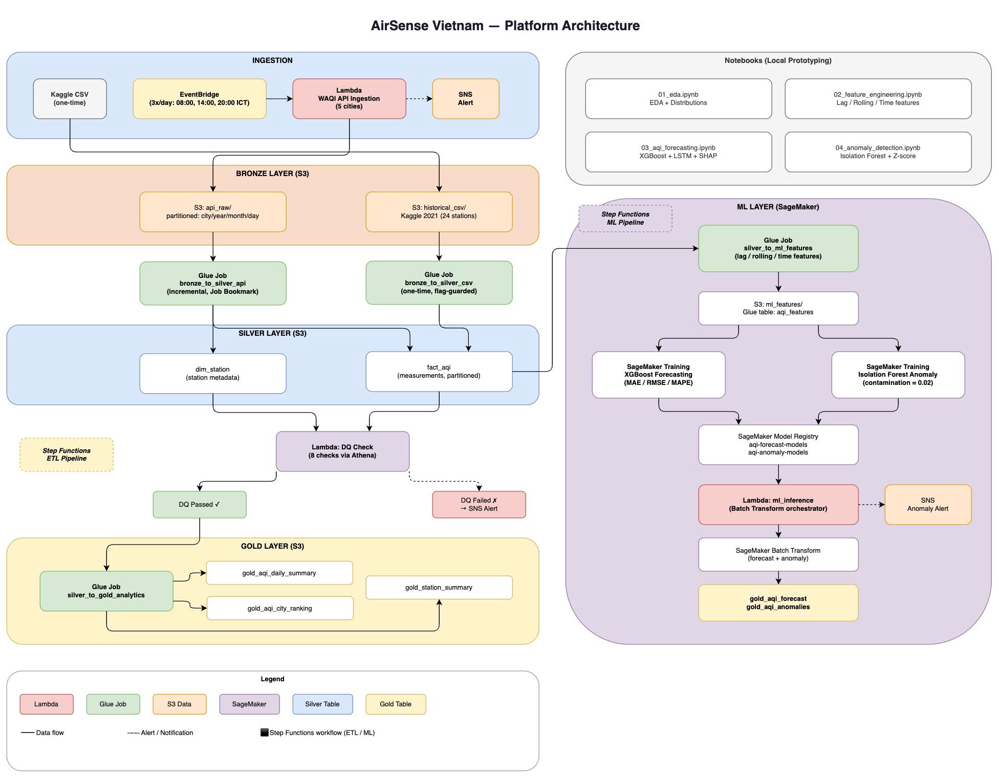

# AirSense Vietnam

An end-to-end air quality analytics platform for 5 Vietnamese cities — combining a production-grade AWS data pipeline with a machine learning layer for AQI forecasting and anomaly detection.

---

## Overview

Air pollution is a growing concern in Vietnam, yet real-time, city-level analytics remain scarce. This project builds a complete data platform that:

- **Ingests** real-time AQI data (3x/day via WAQI API) + historical records (Kaggle 2021)
- **Transforms** raw data through a Medallion architecture (Bronze → Silver → Gold)
- **Validates** data quality automatically before promoting to analytics layer
- **Forecasts** AQI 24h ahead using XGBoost and LSTM models
- **Detects** pollution anomalies using Isolation Forest
- **Orchestrates** everything serverlessly on AWS

Cities covered: **Ha Noi, Ho Chi Minh City, Da Nang, Gia Lai, Cao Bang**

---

## Architecture

```
┌─────────────────────────────────────────────────────────────────┐
│                        INGESTION                                │
│                                                                 │
│  EventBridge (3x/day) → Lambda (WAQI API) → S3 Bronze          │
│  Kaggle CSV (one-time manual upload)       → S3 Bronze          │
└─────────────────────────────────────────────────────────────────┘
                              │
                              ▼
┌─────────────────────────────────────────────────────────────────┐
│                     BRONZE LAYER (S3)                           │
│  api_raw/        partitioned: city / year / month / day         │
│  historical_csv/ one-time Kaggle CSV                            │
└─────────────────────────────────────────────────────────────────┘
                              │
               ┌──────────────┴──────────────┐
               ▼                             ▼
        Glue: bronze_to_silver_api    Glue: bronze_to_silver_csv
        (incremental, bookmarked)     (one-time, flag-guarded)
               └──────────────┬──────────────┘
                              ▼
┌─────────────────────────────────────────────────────────────────┐
│                     SILVER LAYER (S3)                           │
│  dim_station/    station metadata                               │
│  fact_aqi/       measurements, partitioned by city/year/month   │
└─────────────────────────────────────────────────────────────────┘
                              │
                              ▼
                  Lambda: Data Quality Check (Athena)
                              │
               ┌──────────────┴──────────────┐
               ▼                             ▼
         DQ Passed                      DQ Failed
               │                             │
               ▼                             ▼
      Glue: silver_to_gold              SNS Alert
               │                       (pipeline stops)
               ▼
┌─────────────────────────────────────────────────────────────────┐
│                      GOLD LAYER (S3)                            │
│  gold_aqi_daily_summary/   daily aggregates per city            │
│  gold_aqi_city_ranking/    monthly city rankings                │
│  gold_station_summary/     station-level monthly metrics        │
└─────────────────────────────────────────────────────────────────┘
                              │
                              ▼
┌─────────────────────────────────────────────────────────────────┐
│                     ML LAYER (SageMaker)                        │
│                                                                 │
│  Glue: silver_to_ml_features  (lag/rolling/time features)       │
│             │                                                   │
│    ┌────────┴────────┐                                          │
│    ▼                 ▼                                          │
│  XGBoost         Isolation Forest                               │
│  Forecasting     Anomaly Detection                              │
│    └────────┬────────┘                                          │
│             ▼                                                   │
│  Lambda: ml_inference (Batch Transform → Gold ML tables)        │
└─────────────────────────────────────────────────────────────────┘
```

**Orchestration:** AWS Step Functions manages the full ETL flow and ML pipeline independently.



---

## Table of Contents

- [Data Sources](#data-sources)
- [Project Structure](#project-structure)
- [AWS Resources](#aws-resources)
- [Data Schema](#data-schema)
- [Data Quality Framework](#data-quality-framework)
- [Machine Learning Layer](#machine-learning-layer)
- [Deployment Guide](#deployment-guide)
- [Running Notebooks Locally](#running-notebooks-locally)

---

## Data Sources

| Source | Type | Frequency | Scope |
|--------|------|-----------|-------|
| [WAQI API](https://aqicn.org/api/) | Real-time JSON | 3x/day (08:00, 14:00, 20:00 ICT) | 5 cities |
| Kaggle CSV | Historical | One-time load | 24 stations, year 2021 |

### Vietnam AQI Standard

| AQI Range | Level |
|-----------|-------|
| 0 – 50 | Good |
| 51 – 100 | Moderate |
| 101 – 150 | Unhealthy for Sensitive Groups |
| 151 – 200 | Unhealthy |
| 201 – 300 | Very Unhealthy |
| 300+ | Hazardous |

---

## Project Structure

```
AirSense-Vietnam/
├── glue_jobs/
│   ├── bronze_to_silver_statistics/
│   │   ├── bronze_to_silver_statistics_api.py   # Incremental API → Silver
│   │   └── bronze_to_silver_statistics_csv.py   # One-time CSV → Silver
│   ├── silver_to_gold_analytics.py              # Silver → Gold aggregations
│   └── silver_to_ml_features.py                 # Feature engineering for ML
├── lamdas/
│   ├── air-quality-api-ingestion/
│   │   └── lamda_function.py                    # WAQI API ingestion
│   ├── quality_data/
│   │   └── lamda_function.py                    # DQ checks via Athena
│   └── ml_inference/
│       └── lamda_function.py                    # SageMaker Batch Transform
├── sagemaker/
│   ├── forecasting/
│   │   ├── train.py                             # XGBoost training
│   │   ├── inference.py
│   │   └── requirements.txt
│   └── anomaly/
│       ├── train.py                             # Isolation Forest training
│       ├── inference.py
│       └── requirements.txt
├── notebooks/
│   ├── 01_eda.ipynb                             # Exploratory data analysis
│   ├── 02_feature_engineering.ipynb             # Feature pipeline prototyping
│   ├── 03_aqi_forecasting.ipynb                 # XGBoost + LSTM + SHAP
│   └── 04_anomaly_detection.ipynb               # Isolation Forest + Z-score
├── step_functions/
│   ├── pipeline_orchestation.json               # ETL state machine
│   └── ml_pipeline.json                         # ML training + inference
└── raw_data_csv/
    └── historical_air_quality_2021_en.csv
```

---

## AWS Resources

| Service | Resource | Purpose |
|---------|----------|---------|
| S3 | `data-pipeline-bronze-ap-dev` | Raw data |
| S3 | `data-pipeline-silver-ap-dev` | Cleaned data |
| S3 | `data-pipeline-gold-ap-dev` | Analytics-ready data |
| S3 | `data-pipeline-ml-ap-dev` | ML features, model artifacts |
| Glue | 4 databases (bronze/silver/gold/ml) | Data catalog |
| Glue | 5 ETL jobs | Transformation |
| Lambda | `lambda_waqi_ingestion` | API crawling |
| Lambda | `dq_check_silver` | Data quality |
| Lambda | `ml_inference` | Batch inference |
| Step Functions | `aq-pipeline`, `ml-pipeline` | Orchestration |
| EventBridge | 3 schedules | Ingestion triggers |
| SageMaker | Training Jobs, Model Registry, Batch Transform | ML lifecycle |
| Athena | — | DQ queries |
| SNS | `data-pipeline-alerts-dev` | Notifications |

---

## Data Schema

### Silver Layer

**`dim_station`**
```
waqi_idx        int
station_name    string
queried_city    string
lat             double
lon             double
url             string
source          string   ('kaggle' | 'api')
```

**`fact_aqi`**
```
waqi_idx            int
measured_at         timestamp
aqi                 double
dominant_pollutant  string
pm25                double
pm10                double
co                  double
no2                 double
o3                  double
so2                 double
humidity            double
temperature         double
pressure            double
wind                double
source              string
ingested_at         string
queried_city        string   [partition]
year                string   [partition]
month               string   [partition]
```

### Gold Layer

**`gold_aqi_daily_summary`** — Daily city-level aggregates + pollution level classification

**`gold_aqi_city_ranking`** — Monthly city comparison with dense rank by AQI and PM2.5

**`gold_station_summary`** — Monthly station metrics with intra-city ranking

**`gold_aqi_forecast`** — 24h-ahead AQI predictions per city per run

**`gold_aqi_anomalies`** — Anomaly scores and flags per observation per run

---

## Data Quality Framework

After each Silver transformation, Lambda `dq_check_silver` runs **8 checks** via Athena before allowing Gold promotion:

| Check | Description | Threshold |
|-------|-------------|-----------|
| `row_count` | Minimum records exist | ≥ 10 rows |
| `null_pct` | Null rate on critical columns | ≤ 5% |
| `aqi_range` | AQI values within valid range | 0 ≤ AQI ≤ 500 |
| `city_coverage` | All 5 cities present | 0 missing |
| `source_validity` | Only known source values | 0 invalid |
| `freshness` | Data ingested within 48h | > 0 fresh rows |
| `dim_station_row_count` | Station dimension populated | > 0 rows |
| `dim_station_city_coverage` | Stations for all 5 cities | 0 missing |

Any failed check → SNS alert + pipeline stops. Gold job does not run.

---

## Machine Learning Layer

### Feature Engineering (`silver_to_ml_features`)

PySpark Glue job that builds the ML feature table from Silver:

- **Lag features:** AQI at t-1h, t-3h, t-6h, t-12h, t-24h
- **Rolling stats:** mean/std over 3h, 24h, 7d windows
- **Time features:** hour, day_of_week, month (+ cyclical sin/cos encoding)
- **Target:** `aqi` at `t + forecast_horizon_h`

### Models

| Model | Task | Algorithm | Output Table |
|-------|------|-----------|--------------|
| Forecasting | Predict AQI 24h ahead | XGBoost | `gold_aqi_forecast` |
| Anomaly Detection | Flag pollution spikes | Isolation Forest | `gold_aqi_anomalies` |

Both models are registered in **SageMaker Model Registry** with auto-approval gating on MAE threshold for the forecasting model.

### Inference Flow

Lambda `ml_inference` runs in three modes:

- `trigger` — Starts SageMaker Batch Transform jobs
- `collect` — Reads transform output CSVs → writes JSON Lines to Gold
- `full` — End-to-end trigger + wait + collect

---

## Deployment Guide

### Prerequisites

- AWS CLI configured
- Python 3.9+
- IAM permissions: S3, Glue, Lambda, EventBridge, Step Functions, SNS, Athena, SageMaker

### 1. Create S3 Buckets

```bash
for bucket in bronze silver gold ml; do
  aws s3 mb s3://data-pipeline-${bucket}-ap-dev --region ap-southeast-2
done
```

### 2. Create Glue Databases

```bash
for db in bronze silver gold ml; do
  aws glue create-database \
    --database-input "{\"Name\": \"glue-pipeline-${db}-dev\"}" \
    --region ap-southeast-2
done
```

### 3. Upload Glue Scripts

```bash
for script in \
  glue_jobs/bronze_to_silver_statistics/bronze_to_silver_statistics_csv.py \
  glue_jobs/bronze_to_silver_statistics/bronze_to_silver_statistics_api.py \
  glue_jobs/silver_to_gold_analytics.py \
  glue_jobs/silver_to_ml_features.py; do
    aws s3 cp $script s3://aws-glue-assets-<account-id>-ap-southeast-2/scripts/
done
```

### 4. Glue Job Parameters

**`bronze_to_silver_statistics_api`** (enable Job Bookmark):
```
--bronze_database   glue-pipeline-bronze-dev
--bronze_table      api_air_quality_json
--silver_bucket     data-pipeline-silver-ap-dev
--silver_database   glue-pipeline-silver-dev
--stale_hours       48
--sns_topic_arn     arn:aws:sns:<region>:<account>:data-pipeline-alerts-dev
```

**`bronze_to_silver_statistics_csv`**:
```
--bronze_database   glue-pipeline-bronze-dev
--bronze_table      historical_air_quality_2021
--bronze_bucket     data-pipeline-bronze-ap-dev
--silver_bucket     data-pipeline-silver-ap-dev
--silver_database   glue-pipeline-silver-dev
--sns_topic_arn     arn:aws:sns:<region>:<account>:data-pipeline-alerts-dev
```

**`silver_to_gold_analytics`**:
```
--silver_database   glue-pipeline-silver-dev
--gold_bucket       data-pipeline-gold-ap-dev
--gold_database     glue-pipeline-gold-dev
```

### 5. Lambda Environment Variables

**`lambda_waqi_ingestion`**:
```
WAQI_API_TOKEN      = <your_token>
S3_BUCKET_BRONZE    = data-pipeline-bronze-ap-dev
SNS_ALERT_TOPIC_ARN = arn:aws:sns:<region>:<account>:data-pipeline-alerts-dev
WAQI_CITIES         = ha-noi,ho-chi-minh-city,da-nang,gia-lai,cao-bang
```

**`dq_check_silver`**:
```
ATHENA_DATABASE         = glue-pipeline-silver-dev
ATHENA_OUTPUT_LOCATION  = s3://data-pipeline-silver-ap-dev/athena-results/
SNS_ALERT_TOPIC_ARN     = arn:aws:sns:<region>:<account>:data-pipeline-alerts-dev
DQ_MIN_ROW_COUNT        = 10
DQ_MAX_NULL_PERCENT     = 5.0
DQ_FRESHNESS_HOURS      = 48
DQ_SAMPLE_ROWS          = 1000
```

**`ml_inference`**:
```
FORECAST_MODEL_PKG_GROUP  = aqi-forecast-models
ANOMALY_MODEL_PKG_GROUP   = aqi-anomaly-models
ML_FEATURES_BUCKET        = data-pipeline-ml-ap-dev
GOLD_BUCKET               = data-pipeline-gold-ap-dev
GOLD_DATABASE             = glue-pipeline-gold-dev
BATCH_OUTPUT_BUCKET       = data-pipeline-ml-ap-dev
SAGEMAKER_ROLE_ARN        = arn:aws:iam::<account>:role/SageMakerExecutionRole
SNS_ALERT_TOPIC_ARN       = arn:aws:sns:<region>:<account>:data-pipeline-alerts-dev
```

### 6. EventBridge Schedules

| Name | Cron (UTC) | ICT Time |
|------|-----------|----------|
| `aq-ingestion-morning` | `0 1 * * ? *` | 08:00 |
| `aq-ingestion-afternoon` | `0 7 * * ? *` | 14:00 |
| `aq-ingestion-evening` | `0 13 * * ? *` | 20:00 |

### 7. Step Functions

Deploy both state machines from `step_functions/`:
- `pipeline_orchestation.json` — ETL pipeline
- `ml_pipeline.json` — ML training + inference

Update ARNs (Lambda, SNS, Glue job names) before deploying.

### 8. SageMaker Model Package Groups

```bash
aws sagemaker create-model-package-group \
  --model-package-group-name aqi-forecast-models

aws sagemaker create-model-package-group \
  --model-package-group-name aqi-anomaly-models
```

---

## Running Notebooks Locally

```bash
pip install pandas numpy matplotlib seaborn scikit-learn xgboost \
            shap statsmodels pyarrow torch joblib jupyter
cd notebooks/
jupyter lab
```

Run in order: `01 → 02 → 03 → 04`.  
Notebook `02` produces `artifacts/features_2021.parquet` which `03` and `04` consume.

---

## Technical Notes

**Glue Catalog schema quirk:** Crawler parses CSV numeric columns as `STRUCT<double, string>` instead of native types. The CSV Glue job handles this by checking schema dynamically and extracting the correct field.

**Job Bookmark:** `bronze_to_silver_statistics_api` uses Job Bookmark for incremental processing. To reprocess all data: Glue Console → Job → Action → Reset job bookmark.

**dominant_pollutant anomaly:** Value `'aqi'` in the CSV is an Excel artifact (`#NAME?` formula error parsed incorrectly). Pipeline replaces this with null before writing to Silver.
